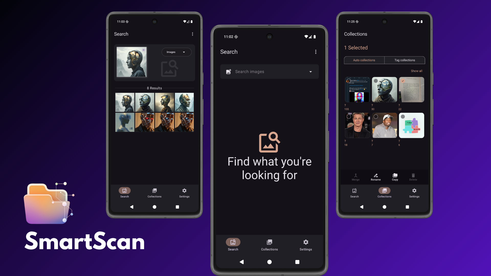
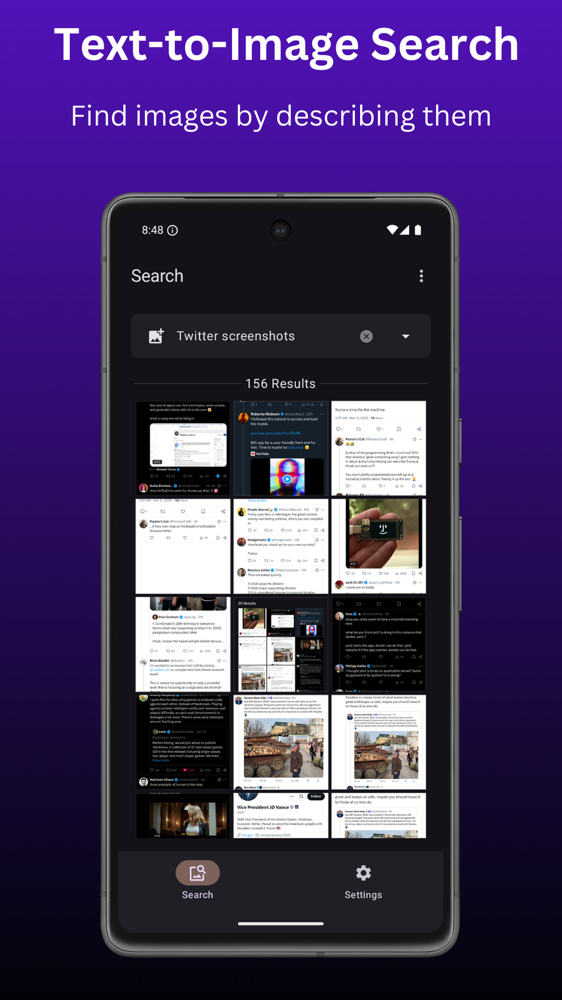
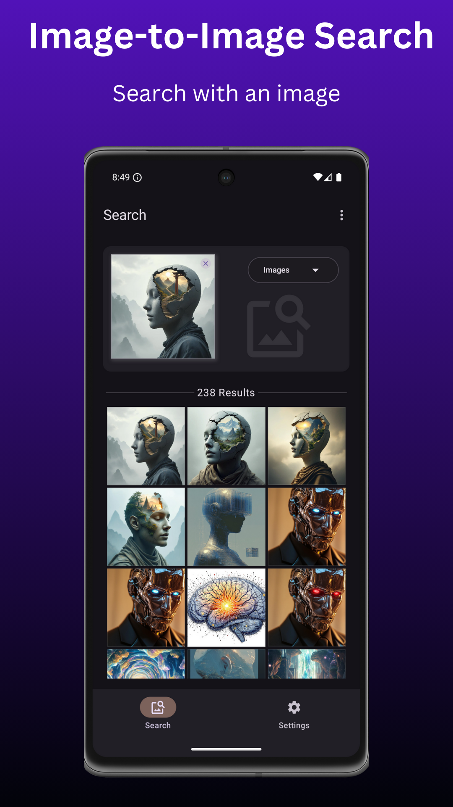
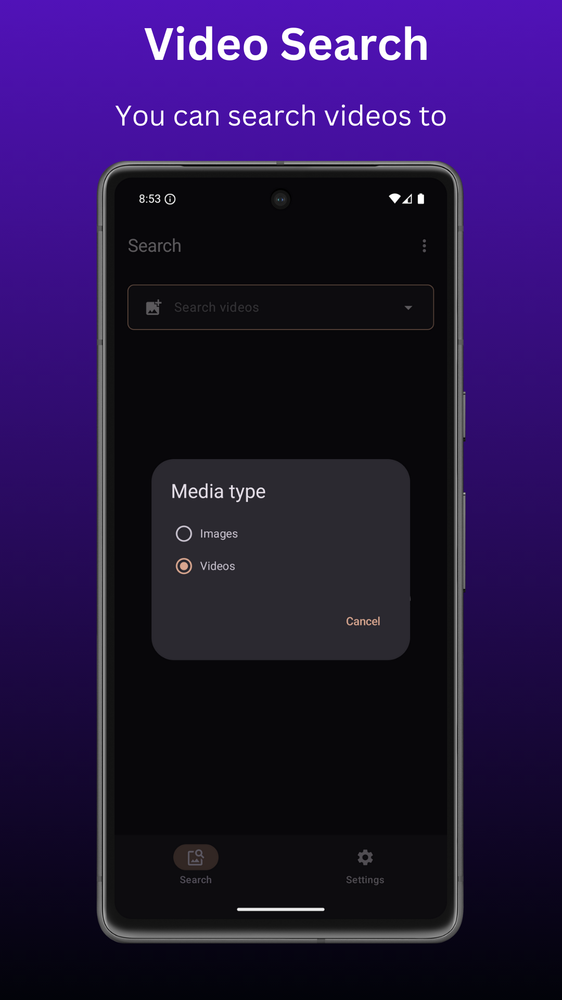
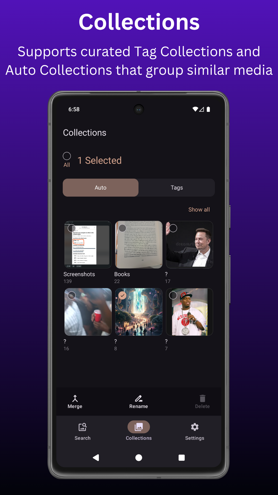

# SmartScan - Media search engine app

Search images and videos offline using text or by reverse image search with on-device AI.

  

|  |  |  |  |
|------------------------------------------------------------------------------------------------------------|------------------------------------------------------------------------------------------------------------|------------------------------------------------------------------------------------------------------------|------------------------------------------------------------------------------------------------------------|

---

## Buy Me A Coffee

The app is free, but if you enjoy using it and want to support project development and maintenance, consider donating using one of the options below. One of my main goals is training my own model to replace CLIP for improved accuracy.

### Donate with Kofi

### Donate with crypto

| Wallet   | Address                                     |
|----------|---------------------------------------------|
| Bitcoin  | bc1qw46nxjp5gkh460ewamjd3jfeu0xv6ytq5et6xm  |
| Ethereum | 0xa53aC18B25942C71019f85314AF67F6132E525ad  |
| Litecoin | ltc1q2hspfea9rw5j2ymvv22hx7dmckh8c99sqk7av3 |

---

## Key Features

All processing is handled entirely on-device, ensuring privacy, speed, and offline functionality.

### Search:
* Search images and videos
* Search using text or images
* Search by tag
* Search by tag + text query
* Search from other apps via share/intent
* Search by pasting image in search bar
* Cluster-based search
* Automatically refresh image and video indexes for new content
* Optionally configure searchable image and video folders
* Optionally open search results in default gallery

### Tagging:
* Add tags to media
* Tag autocomplete when searching or tagging

### Collections:
* Auto Collections: automatically groups similar media
* Tag Collections: manually curate collections using tags
* Merge Tag Collections
* Bulk copy from Auto Collections to Tag Collections

---

## Download

Go to [Releases](https://github.com/dev-diaries41/smartscan/releases/latest) and download the latest apk.

To download on F-droid you must now add the archive repository in the F-droid client app. The latest version is not current available on F-droid.

[//]: # (
)

[//]: # (  <a href="https://f-droid.org/packages/com.fpf.smartscan" style="text-decoration: none;">)

[//]: # (  )

[//]: # (  </a>)

[//]: # (
)

---

## License

 * This project is licensed under the GNU General Public License, Version 3 (GPLv3).
 * See the LICENSE file for details.

---
